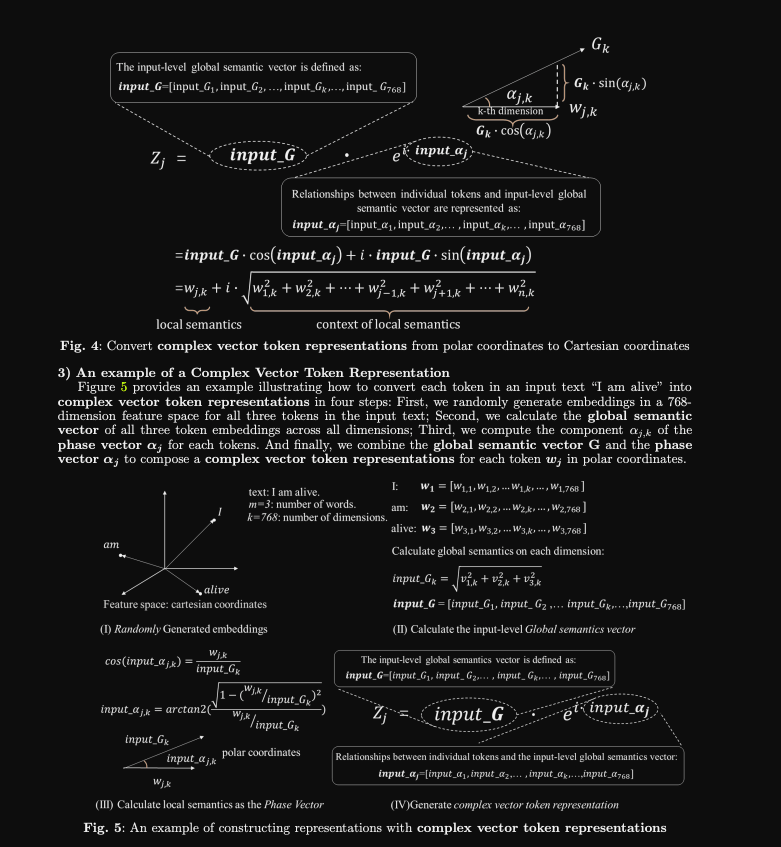

以下の論文を組み合わせた理論を考えたい。

[Wave Network: An Ultra-Small Language Model](https://arxiv.org/html/2411.02674v4)
[Cut Your Losses in Large-Vocabulary Language Models](https://arxiv.org/html/2411.09009v1), (https://pypi.org/project/cut-cross-entropy/)

[RoFormer: Enhanced Transformer with Rotary Position Embedding](https://arxiv.org/abs/2104.09864)
[From Word Models to World Models: Translating from Natural Language to the Probabilistic Language of Thought](https://arxiv.org/pdf/2306.12672)
[Large Language Diffusion Models](https://arxiv.org/pdf/2306.12672)
[WorldGPT: Empowering LLM as Multimodal World Model](https://arxiv.org/html/2404.18202v2)
[WaveletGPT: Wavelets Meet Large Language Models](https://arxiv.org/abs/2409.12924)
[WavSpA: Wavelet Space Attention for Boosting Transformers' Long Sequence Learning Ability](https://arxiv.org/pdf/2210.01989)
[Native Sparse Attention: Hardware-Aligned and Natively Trainable Sparse Attention](https://arxiv.org/abs/2502.11089)
[Titans: Learning to Memorize at Test Time](https://arxiv.org/html/2501.00663v1) # google deepmild 長期記憶をもたせる

モデルにはコンテキスト長の制限があるため、文書全体がその制限を超える場合は「チャンクに分割して要約をつなぐ」「Retrievalで必要な箇所を取り出す」「長コンテキスト対応モデルを使う」といった手法が用いられる。

について、それぞれ「理科系の大学1年生レベルでもわかるように」ざっくりと解説します。両方とも自然言語処理（NLP）や言語モデルに関する研究ですが、アプローチが少し異なります。

---

1. Wave Network: An Ultra-Small Language Model

論文概要
	•	「Wave Network」という、ものすごく小さい(パラメータ数が極小)モデルでありながら、ある程度の文章生成や理解を可能にする言語モデルを提案しています。
	•	小さいモデルは計算資源やメモリが少なくて済むので、モバイル端末や組み込みシステムなどでも動作しやすくなるメリットがあります。

もう少し詳しいしくみ
	•	もともと音声処理の世界で広く使われている WaveNet (音声生成モデル)に名前が似ていますが、中身は大きく違います。
	•	「Wave」という単語は、“波”のように層の中で特徴が段階的に加算・変調されていくことをイメージさせます。従来のTransformerなどとは異なる構造を用い、重み(パラメータ)をできるだけ少なく設計する工夫がされています。
	•	通常の大きな言語モデル(例えばGPTやBERT)は数百万〜数十億のパラメータを持ちますが、Wave Networkはそれを大幅に削減し、数千〜数百万程度の小さな規模に抑えようという発想です。(1/1000)

なぜ小さいと嬉しいか？
	•	モデルが小さいと学習や推論が高速になる→計算コストが減る
	•	メモリ消費量が少ない→安価なGPU/CPUや組込み系でも動かしやすい
	•	実用性：クラウドに限らず、スマートフォンやエッジデバイスなどでローカルに動かすことが可能

ただし課題もある
	•	パラメータを減らすと通常は性能(予測精度や文章生成の自然さ)が落ちやすい。
	•	Wave Networkは、この問題をモデル設計の工夫で最小限に抑えようとしている。

input_G = [input_G1, ... , input_G768]: 文書全体の意味を表すベクトルの集合 
input_αj: G_kとw_j,kとの角度: 個々の単語と文章全体の関係を表す位相ベクトル
Zj = input_G・cos(input_αj) + i・input_G・sin(input_αj) : 実部が単語自身、虚部が文脈の意味を表す。

---

1. Cut Your Losses in Large-Vocabulary Language Models

論文概要
	•	“Cut Your Losses” は直訳すると「損切りせよ」という感じで、研究のアイデアは「大きな語彙（ボキャブラリ）を扱うときの学習コストを減らそう」というものです。
	•	大規模言語モデル(Large-Vocabulary Language Models)では、出力単語の種類（語彙数）が増えるほどソフトマックス計算などが膨大になります。これが計算ボトルネックになることがあります。

もう少し詳しいしくみ
	•	一般的な言語モデルは、最終層で「どの単語を次に出力するか」を確率的に決めるためにソフトマックスという計算を行います。
	•	ソフトマックスは「入力ベクトルの全要素に対して exp(...) を計算して合計を正規化する」という仕組みで、これは語彙が数万〜数十万単語と巨大だと非常に重くなります。
	•	そこで、この研究では効率的な損失（ロス）の計算手法やサンプリング手法を使って、全単語分の計算をしなくても済むように工夫しています。例えば、「出現可能性が低い単語はそもそも計算から外してしまう」「計算を段階的にフィルタリングする」といった方法が考えられます。

得られるメリット
	•	大量の単語を扱うときでも、計算の重さを抑えられる。
	•	モデルの学習や推論の時間が削減できるので、大規模データで学習しやすくなる。
	•	トレーニングや推論に要するコストの削減は、現場で大きなメリットにつながる(電気代が下がる、学習時間が短くなる、サーバー台数を減らせる 等々)。

2つを組み合わせるとどうなる？
	•	Wave Network は「軽量・小型化に向いたアーキテクチャ」で、Cut Your Losses は「大きな語彙を扱うときの計算効率を高める仕組み」です。
	•	もしWave Networkが日本語で使うために大きい語彙(日本語は漢字・ひらがな・カタカナ・外来語など文字種類が多い)を必要とするなら、学習コストが膨大になる恐れがあります。
	•	そこで Cut Your Losses のアイデアを併用することで、大きい語彙を扱いつつも最終出力のソフトマックス計算等を最適化して、計算リソースの節約が期待できます。
	•	また、小型モデルでありながら大きな語彙を無理なく扱えるようになるので、「日本語のように文字や語彙が多い言語を対象とした、超小型言語モデル」の実現を目指せるわけです。

---

まとめ
	•	Wave Network は、小さなパラメータ数でも言語モデルとして機能する革新的なアーキテクチャ。
	•	Cut Your Losses in Large-Vocabulary Language Models は、出力語彙が多いときの学習・推論コストを減らすための工夫。
	•	日本語のように文字・語彙が膨大な言語を扱う場合、小型化と大規模語彙対応の両面で課題が出やすいですが、これら2つの研究成果を組み合わせることで、比較的軽く動きつつそこそこの性能を期待できるモデルを作れる可能性があります。

このように、両論文をうまく応用すれば、超小型かつ大語彙対応の日本語モデルが作れるかもしれない、というのが大まかな流れです。

---

さらに。、、
以下は、「**From Word Models to World Models: Translating from Natural Language to the Probabilistic Language of Thought**」という論文の概要および主張、主要な手法・実験・結果のハイライトの簡単な要約です。

## 論文の概要・主張

1. **背景: “Word Models”から“World Models”へ**  
   - 従来の自然言語処理（NLP）は、単語や文章などの表層的な分布（語同士の共起関係など）を捉えることで意味を扱おうとする「Word Models（分布的意味論）」が主流だった。  
   - しかし、人間の思考や認知は、単語レベルを超えた深い概念理解（“World Models”）を伴う。ここで言う「World Models」とは、確率的推論や構造的知識表現を統合し、複雑な概念や世界の仕組みを捉える認知モデル（「Probabilistic Language of Thought」）を指す。

2. **主張: 自然言語を「確率的思考の言語」に翻訳するアプローチ**  
   - 論文では、自然言語（例えば文章や命題文）を、確率論的に記述できる内的表現・推論メカニズム（Probabilistic Language of Thought: PLT）へと変換する枠組みを提案している。  
   - これにより、単なる単語レベルのベクトル表現（埋め込み）にとどまらず、推論やシミュレーションが可能な高次の概念表現を獲得し、「Word Models」の限界を突破することを目指している。

---

## 主要な手法・アプローチ

1. **自然言語から構文解析・意味解析を行い、論理・確率モデルへマッピング**  
   - まず、入力となる文（自然言語）を形態素・構文レベルで解析し、論理的・階層的に構造化する。  
   - その後、文の意味を「ランダム変数や確率分布、因果関係」を記述するための形式言語（PLT）に変換する仕組みを導入する。

2. **確率的プログラム（Probabilistic Programming）の利用**  
   - 論文では、確率的プログラムを用いて複雑な世界知識や概念間の依存関係を記述し、**ベイズ推論**や**シミュレーション**を実行可能にする。  
   - これにより、単なる単語同士の類似度ではなく、**概念間の因果・階層構造**を推論に含められる。

3. **大規模言語モデルとの連携**  
   - 近年の大規模言語モデル（例: GPT 系列）などが持つ文脈把握能力を利用しつつ、そのアウトプットを確率的プログラムへとさらに翻訳する、または逆に確率的プログラム側の推論結果を自然言語へ戻すといった「相互変換」を想定している。  
   - これにより、GPT のようなモデルが表層的に捉えた「文脈」を、確率的推論の枠組みで深く解釈することが期待できる。

---

## 実験・結果のハイライト

1. **意味的推論タスクでの性能向上**  
   - ある文から別の文へ推論を行うようなタスク（例: 「もし A ならば B」という命題に対して「A を満たすとき B の確率がどう変化するか」を推定するなど）において、確率的言語表現（PLT）を用いることで、単なる単語分布ベースのモデルを上回る性能が報告されている。  
   - 具体的には、論理的・因果的な関係を要するタスクで顕著に改善が見られる。

2. **概念学習と生成タスクへの応用**  
   - 概念学習（例: 「ある概念が正しいときに、他の概念はどの程度影響を受けるか」）や新規文生成タスクにおいて、PLT に基づくモデルの方がより“筋の通った”推論や生成が行える例が提示されている。  
   - また、単純なテンプレート置き換えでは説明しにくい文生成を、確率的なシミュレーションを通じて実現している点が強調される。

3. **エラー分析・限界**  
   - ただし、自然言語から完全に正しい確率モデルを構成するのは依然として難しく、特に文脈依存の曖昧表現や多義性（メタファーや省略）などへの対処には課題が残ると指摘している。  
   - また、計算コストや大規模データセットへの適用時のスケーラビリティなど、実用面でのハードルがまだ高いことが述べられている。

---

## まとめ

- **論文の着眼点**  
  - 自然言語処理の「表層的な単語分布ベース」から一歩進み、**確率的・階層的な概念モデル（World Models）**に接続するという発想が新しい。  
  - 人間の認知科学で提案されている「Language of Thought」仮説を、ベイズ的アプローチや大規模言語モデルと組み合わせた点に大きな特徴がある。

- **今後の展望**  
  - 大規模言語モデルの文脈把握能力と、確率プログラミングによる論理的・因果的推論を統合する試みとして注目される。  
  - 自然言語から抽象的な概念理解や推論を構成する研究がさらに発展すれば、**より強力な推論能力を持った言語モデル**が期待される。  
  - ただし、データの品質やモデルのスケーラビリティ、曖昧性への対処など未解決の課題も多く、今後の研究が必要である。

以上が、本論文の概要・主張、主要な手法・実験・結果のハイライトです。簡潔にまとめると、**自然言語と「確率的思考の言語」の橋渡しを実現することで、従来の分布的意味論を超えた深い概念理解や推論能力を目指すアプローチ**といえます。

以下では、前回答の英語テキスト全体を日本語に翻訳したものを示します。元の英語テキストで示されていた文献参照（例: 【8†L18-L27】など）はそのままにしていますが、本文は日本語で表現しています。

---

## Wave Network の有用性と Attention を用いないアーキテクチャ

### 3～6層程度の Wave Network：言語モデルとしての有効性

**Wave Network** は、各トークンを標準的なアテンションではなく、複素ベクトル（グローバル意味を示す振幅とトークン間関係を示す位相）で表現する超小型のLMとして提案されました【8†L18-L27】。たった **1層** のWave Networkでも、AG News分類で約91%の精度を達成し、2.4Mパラメータという極めて小規模ながら、fine-tuned BERT-base（94.6%）に迫る結果を出しています【28†L25-L33】。また、同程度のパラメータ数の単層Transformerベースラインよりも約19～20%ほど精度が高く、VRAM消費が約77%少なく、学習時間は約85%短いというデータがあります【28†L25-L33】。つまり、**非常に浅いWave Networkでも豊富な表現学習が可能**であることを示唆しています。

Wave Network の論文では、複数レイヤを積み重ねて出力を次の層へ入力する構造にも言及されています【10†L316-L324】。著者は主に1層のケースを検証していますが、3～6層程度重ねることでモデル容量と深さが増し、文生成など複雑な言語タスクに対してより高い性能が期待できます。単層でも強力であるため、少数の層を積むだけで（Transformerほど多層でなくても）十分な文脈理解が期待できるでしょう。ただし、特に生成タスクのように複雑なタスクでの性能はまだ広範に検証されていないため、注意深い評価が必要です。Wave Network はドキュメント分類や短い文脈のQAなどでは高い効率性を見せそうですが、本格的なオープンエンドの生成にどれほど通用するかは未知数です。

### S5, Mamba, Samba, Hymba との比較

WaveNet以外にも、計算量を削減しつつ精度を維持するよう設計された **小型LLM向けアーキテクチャ** が存在します。  
- **S4/S5** などの Structured State-Space Model (SSM) はアテンションなしでも長距離依存関係を効果的に処理し、長文タスクで優れた性能を示しました。特に S4 は畳み込みベースの状態空間ダイナミクスを使って長文でも高い性能を発揮し、S5 はそれを簡略化して1つの多入力・多出力SSMにまとめた手法【35†L53-L61】。  
- **Mamba** は、これら SSM のアイデアを発展させつつ、アテンションを完全に排除しつつも、約3BパラメータのMambaモデルが同規模のTransformerと同等、あるいは2倍の大きさのTransformerに匹敵する結果を出しています【5†L35-L39】。  
- ただし、**完全にアテンションを排除** すると、正確なメモリリコールや推論パターンで苦戦する場合があります【32†L60-L68】。  
- そこで提案されているのが **SAMBA (Simple Hybrid SSM+Attention)** や **HYMBA** のような **ハイブリッドモデル** です。  
  - **SAMBA** は各層で Mamba 風のSSMレイヤとローカルなスライド窓アテンション(SWA)を組み合わせ、4kトークンの文脈で学習しても256kや1Mの長文に推論時に拡張可能と報告しています【31†L39-L49】。  
  - **HYMBA** は各層内でアテンションヘッドとSSMヘッドを並列に動作させる構造で、メモリキャッシュを削減しながら高い精度を実現しています【32†L69-L77】。**1.5BパラメータのHymbaが3.2B LLaMAを平均指標で上回る** という非常に有望な結果を出しており、同時に推論スループットも大きく向上しています【32†L49-L57】。

したがって、**アテンションを使わないモデル**（Wave Network や Mamba）でも十分高い性能を得られる可能性はありますが、生成タスクや推論的なタスクでは、SSMとアテンションを組み合わせるハイブリッド構造（SAMBA / HYMBA）が弱点を補完しあってより高精度になる傾向があります。少数パラメータで幅広いタスクをこなすには、**SSMで長距離依存を効率良く処理しつつ、ローカルな詳細をアテンションで捉える** という戦略が有効です。【32†L49-L57】【31†L39-L49】。一方、モデルを極限まで小さく・高速化したい場合は、完全にアテンションを排除した構造を目指すのもあり得ます。

### Attention-free vs. 高速化されたAttention (FlashAttention2)

これらのアテンションレス手法は、計算効率とメモリ効率の面で非常に魅力的ですが、アテンション自体の強力さを捨てるのはトレードオフを伴います。アテンションなしでもS4/S5やMambaで高い性能が報告されており【5†L35-L39】【28†L25-L33】、長文入力のときO(n^2)のボトルネックを回避できるのは大きな強みです。しかし、トークン間の局所的・明示的な関係を捉える能力はやはりアテンションが得意であり、完全に排除すると別の仕組み（ゲーティング機構や複雑なSSM設計）が必要になる可能性があります。

一方、**FlashAttention 2** のような最適化された実装を使うことで、従来のアテンションのメモリ問題を大幅に軽減できるようになりました。CUDAカーネルやメモリ管理を効率化することで、厳密なアテンション計算をしながらも高速化・低メモリ化を実現しています。学習・推論の速度が倍程度向上し、メモリ使用量が削減されるという報告があります【17†L51-L58】。つまり、アテンションを完全に排除せずとも、FlashAttention2 であれば **アテンションの表現力を保ちつつリソース使用を抑えられる** 可能性があります。特に小型モデルでも、アテンションを少し使うだけで性能が向上するケースは多く、そこをFlashAttention 2 が支えてくれます。

以上より、**アテンションを完全に無くすか、FlashAttentionなどで効率化して残すか** は、ターゲットタスクとハードウェアリソースに左右されます。SAMBAやHYMBAを見ても「SSM＋最小限のアテンション」が高い性能を示している例が多いため、最高精度を狙うなら多少のアテンションを残してFlashAttentionを使う方法が有望です。ただし高速化・単純化に全振りするならWave NetworkやMambaのようにアテンションを排除するアプローチも選択肢になるでしょう。

---

## モデルサイズと計算コスト

### Colab/A100 制約下での最適なモデルサイズ

Google Colab（ProやPro+）上のNVIDIA A100（通常40GB VRAM）を想定すると、そこそこ大きめのモデル（数億〜10億パラメータ程度）までならmixed precisionや勾配チェックポイントなどを駆使して学習可能です。数十億(1～2B)パラメータを超えると、学習時間やメモリの点で現実的でなくなるかもしれません。そこで、**小型モデル** という観点から見ると **50M〜500Mパラメータ程度** が1枚GPUで扱いやすく、かつ最低限の表現力を確保できる範囲でしょう。  
例として、**Wave Network** は768次元埋め込み＋1層のみで約数百万〜千万パラメータと非常に小規模です【10†L300-L308】。これを6層重ねても1500万前後程度と推測でき、非常に軽量です。あるいは、**S5/Transformerハイブリッド** で12層・隠れ次元384・ヘッド4等にすると、ざっくり5000万パラメータ前後かもしれません。  
実際にこれを学習する際は、mixed precision (FP16やbfloat16) や勾配チェックポイント（計算量と引き換えにメモリを節約する）を使うことでA100のメモリを効率的に活用できます。A100のTensorコアを最大限利用できるよう、S4/S5やFlashAttentionのようにGPUフレンドリーな演算を組み込むのも有効です。

### 計算コスト削減の手法

Colab環境で現実的に学習を進めるには、次のような圧縮や効率化が重要になります。

1. **低ランク分解（Low-Rank Decomposition）**  
   重み行列を低ランク行列の積に分解し、パラメータ数と計算量を削減する手法です。大規模モデルでも1～2割程度のパラメータを削減し、推論を高速化できるという報告があります【34†L57-L65】。例えば行列 \( W \) を \( U \times V \) の積に分解して層を構成し、同等の表現力を保ちながらパラメータを減らすことができます。事前学習後に低ランク近似を適用する「ポストトレーニング圧縮」もある一方で、最初からファクトライズド層を使う（ボトルネック層の導入など）こともあります。

2. **パラメータ共有**  
   ALBERT のように、全層で重みを共有する方法でパラメータ総数を大きく削減することが可能です。Wave Networkを6層積んでも、同一の重みを使い回せばパラメータはほぼ単層と同等になります。ただし性能への影響は大きい場合がありますが、データが少ない時には過学習を防ぐ効果もある可能性があります。

3. **S4/S5の採用による効率的な系列処理**  
   アテンションを使わずにS4/S5で系列を処理すると、**O(n)** または近似的に線形にスケールし、長いシーケンスも扱いやすくなります【35†L53-L61】。並列FFTや畳み込みを活用して高速に学習でき、メモリ使用量もTransformerより大幅に抑えられます。SAMBAでは数十k〜100k以上の長文に対してTransformerより高速だったとの報告があります【31†L61-L67】。日本語QAでも、JSQuADの文脈が長くなる場合に有効でしょう。

4. **量子化（Quantization）**  
   学習または推論時に重みを8bitあるいは4bitに量子化し、メモリ占有と計算コストを削減します。学習時にはbitsandbytesなどを使ってAdam のモーメントを8bit化するなども可能です。推論時に4bit量子化を適用すれば、はるかに小さなVRAMでモデルを動かせます。これは最終デプロイを意識する場合に特に有効です。

5. **効率的なアテンション形態**  
   アテンションを採用する場合、スライド窓や局所的なブロック型に制限する、あるいはFlashAttention2を使うことで O(n^2) コストを大幅に削減できます。例えばSAMBAのように、**SSMで大局的な文脈を扱い、局所窓でのみアテンション** するハイブリッド構造なら、長文に対して計算量を抑えつつ詳細な依存関係を捉えられます【31†L39-L47】。

まとめると、**小型・効率的** なモデルを目指すには、パラメータ数を抑えつつ（~100M規模など）、S4/S5のような計算効率の高い手法やFlashAttention2等のGPU最適化を組み合わせ、mixed precision や勾配チェックポイントなどを駆使すると、Colab/A100 でも十分学習可能な枠内に収められます。これらの工夫により、モデルは「小さいが高性能・省メモリ」というメリットを享受できます。

---

## データセットと学習戦略

### JSQuAD を使った日本語QAトレーニング

**JSQuAD** は日本語版のSQuADに相当するReading Comprehensionデータセットで、各サンプルに日本語Wikipediaの文脈段落と質問、文脈中の回答スパンが付与されています【15†L3-L7】。日本語のQAや読解タスクに特化するなら、これを使用するのは妥当です。通常のSQuAD同様、事前学習済みモデルをJSQuADでファインチューニングすることで、文脈内の回答位置を予測したり回答テキストを生成したりできるようになります。

多くの既存モデル（BERTベースなど）は、大規模な日本語コーパスで事前学習した後にJSQuADを微調整し、F1スコア90%超を達成しています。例として、BERT-large日本語版（Waseda RoBERTaなど）は約91.8% EM / 96.3% F1と、人間性能に近いレベルに到達【38†L473-L481】。しかしそれは事前学習と数千万〜数億パラメータの容量によるもので、**小型モデルをゼロからJSQuADだけで学習** する場合は、データ不足で苦戦する可能性があります。そこで、

1. **データ拡張**: JSQuADの例数（2万件程度）を拡張するため、英語SQuADを日本語に機械翻訳したり、大型マルチリンガルモデルで疑似Q&Aペアを生成したりして、学習データを増やす。  
2. **マルチタスク学習**: JSQuADに加え、日本語コーパスで言語モデリングタスクを同時学習し、モデルに日本語の一般的知識を付与する。  
3. **知識蒸留**: GPT-4など大規模モデルからの出力回答やロジットを利用し、教師として小型モデルに学習させる。大きなモデルの知識を移しやすい。  

などの工夫が有効です。さらに、過学習を防ぐためにドロップアウトやearly stopping、JSQuADのdevセットを用いたバリデーションが不可欠でしょう。

回答形式については、**抽出型QA**（開始位置と終了位置を予測）か、**生成型QA**（文脈と質問を入力し、回答文を生成）かを選べます。文生成など他タスク（要約や翻訳）も視野に入れるなら、**シーケンス・トゥ・シーケンス形式** で学習するのが汎用的です。たとえば「質問: {question}\n本文: {context}\n答え:」というプロンプトを与え、モデルが回答文を生成するように訓練すれば、自然言語出力が得やすくなります。

小型モデルで高精度を狙うためには、**知識蒸留** が特に有用です。例えば大きな日本語LLMやGPT-4にJSQuADの質問を与え、その回答を小型モデルが模倣するよう学習すると、回答分布を大きなモデルに近づけられます。DistilBERTがBERT-baseから知識蒸留したように、QAタスクにも蒸留は効果的です。初期埋め込みを既存の日本語BERTなどの単語埋め込みに合わせるなど、**初期重みを工夫** するのも手です。  
また**カリキュラム学習** のように、単純なサンプルから段階的に学習難易度を上げる方法も検討できます。こうした手法を組み合わせることで、数千万パラメータ規模のモデルでも意外と高い精度が期待できます。実際、~110Mパラメータの日本語BERTをJSQuADにfine-tuneした場合、F1 94%前後を達成した事例もあります【38†L473-L481】。同等のパラメータ帯でWave NetworkやS5などの効率的な構造を使えば、さらに良い可能性もあるでしょう。

---

## 既存モデルとの比較

### 古いJSQuAD学習モデルとの比較

日本語QAの初期は、マルチリンガルBERTなどを直接JSQuADにfine-tuneして70～80%台F1の結果を得るのが主流でした【39†L55-L60】。それらはまだ大量の日本語事前学習を十分していなかったり、モデル自体がTransformerベースラインで工夫が少なかったりします。近年はWaseda RoBERTa-large等で90%以上を記録しており【38†L473-L481】、性能が大きく伸びています。

我々が超小型モデルを1から学習する際、**Wave/S5などの工夫** を取り入れれば、古い単純Transformerベースラインを上回る精度を狙えるかもしれません。さらに蒸留・データ拡張などを行えば、過去の「JSQuADだけで学習した小さめモデル」よりは高い精度が見込めます。ただし、すでに大規模事前学習済みの日本語BERT-largeをさらにfine-tuneしたモデル（F1 96%など）と比較すると、絶対値では負ける可能性が高いです。しかしその場合でも、パラメータが1/10以下で推論も高速というアドバンテージを打ち出せるでしょう。  
言い換えれば、従来の小型モデルがやっていたような「パターンマッチ的な対処」より、**WaveやSSMを取り入れてより表現力を高めた構造** の方が少ないパラメータで多くを学習できる可能性があります。結果として、古いJSQuAD専用モデルとの比較では**小型で高精度** を実現しやすいと期待されます。

### 既存日本語LLM（Gemma, TinyLlama, Phi-2 など）との比較

他にも、日本語対応可能な軽量LLMとして  
- **Gemma-2 (2Bパラメータ)** : Google が2024年に公開した多言語LLMで、日本語特化版(Gemma-2 JPN)は GPT-3.5レベルに近い性能があるとされる【11†L37-L40】。2Bという比較的大きいがコンパクトな規模で、広範なタスクに対応。  
- **TinyLlama (1.1Bパラメータ)** : 約1兆トークンを学習したオープンソースの小型LLaMA系モデル。1.1Bにもかかわらず非常に強力で、1.3BのGPT-J等を上回る性能を示す【17†L53-L58】。  
- **Phi-2 (2.7Bパラメータ)** : Microsoft が発表したPhiシリーズの1つ。約2.7Bパラメータでありながら、13B級モデル並みの性能をいくつも示し、非常に高い推論・推定能力を持つ【40†L181-L189】。

これらは数億パラメータ以下ではなく、1～3B程度の規模。大規模に良質データで事前学習されており、小型とはいえ強力な下地があります。それらと比較すると、**我々の狙うモデルはさらに小さい**（場合によっては1～2桁パラメータが少ない）ため、汎用的な性能では及ばない可能性が高いです。ただし、これら大きいモデルは推論時のメモリや計算が重いので、**本当に超軽量で日本語QAに特化したモデル** という観点では差別化できます。JSQuADを含む日本語ドメインに特化し、蒸留やデータ拡張を駆使すれば、ある程度これらのモデルに迫るタスク特化性能を示すことは不可能ではありません。

例えば、TinyLlama(1.1B)がもしJSQuADにfine-tuneされたら素晴らしいスコアを出すでしょうが、トレーニングコストもそれなりにかかります。一方、**パラメータ ~100M** の超小型モデルがFlashAttentionやS5、Waveletなどを活用しつつJSQuAD専用で最適化されれば、QAタスクにおいてそこそこ高いスコアを得つつ、メモリ使用ははるかに少ないという利点があります。つまり、**極小さなフットプリントでQA特化の性能を示せるか** が勝負どころになります。  
GemmaやPhi-2のように数十億トークン～数兆トークン級で前訓練されたモデルと真正面から比較すると、やはり上限性能では叶いませんが、**用途特化**・**低リソース運用** の点で価値があります。さらに実運用で知識不足が問題になれば、Retrieval Augmentation（外部データベース参照）を組み合わせて補うこともできます。

---

## 小型日本語LLMに有望な他の技術

### RoFormer（Rotary Position Embedding）による位置表現

トークン列の順序や文脈長を正しく取り扱うには、位置情報が重要です。**RoFormer** は、**RoPE (Rotary Position Embedding)** を提案したTransformer変種で、クエリ/キーを多次元空間で回転させる形で連続的に位置を組み込む方法です【27†L55-L64】。これによって、学習した長さ以上にも比較的スムーズに一般化できるほか、遠いトークンへの相互作用が減衰するような性質を自然に表現できます【27†L57-L65】。  
実際、BERTに比べて長文タスクでの精度が向上し、RoFormerは多くのLLM実装（GPT-NeoXやLLaMA等）にも採用されているロータリー埋め込みの原型として位置付けられています。これはパラメータをほぼ増やさずに位置表現を強化する手法なので、**小型モデルでも導入しやすい**。  
また、Wave Networkの位相ベクトル概念とRoPEの「回転による位置表現」はコンセプト的に近い部分があります。両者を組み合わせるなどの拡張も考えられますが、最低限、**RoPEのようなロータリー埋め込みを使って位置情報を表現** するのは非常に有力でしょう。日本語特有の語順や助詞の扱いにおいても、長文への汎化性能向上が見込まれます。

### Multi-Scale 表現：WaveletGPT

**WaveletGPT** は信号処理のウェーブレット変換を埋め込み処理に組み込み、マルチスケールの特徴表現を可能にするアプローチです【19†L39-L47】。階層的な周波数（粗～細）を同時に扱い、各レイヤや次トークン予測時に広域・局所両面の情報を参照できるのが特徴です。結果として **同じ学習ステップ数でも収束が速く、大きなモデルと近い性能** を得ることができる、あるいは約半分のステップ数で同等の損失に到達できるなどの報告があります【19†L39-L47】【21†L7-L11】。  
これはまさに「小型モデルの性能を引き上げる技術」として注目されており、大きなモデルを長時間学習せずとも、マルチスケールの構造が効率的な学習を促進していると考えられます。具体的には、隠れ状態を離散ウェーブレット変換(DWT)に通して粗いコース成分と詳細成分に分割し、両方に注目することで一種の「深さ」や「幅」を仮想的に補完しているイメージです。  
Wave Network も振幅・位相という2種類の要素を扱いますが、WaveletGPTの波面多重化はもう少し階層が多いので、**ウェーブレットを用いた多段階の特徴抽出** と組み合わせることで、小型モデルでも文脈把握をより効率的に行えるかもしれません。パラメータが増えるわけではなく、埋め込みや中間表現の処理フローを工夫するだけなので、導入しやすい利点もあります。  
日本語QAでは文脈の主題やトピックを粗いスケールで捉え、細かい回答箇所を細スケールで捉える、という具合に**マルチスケール** が自然に働く可能性があります。学習も高速化が期待されるため、**小さなモデルでも短期間で収束** しやすくなる利点があるでしょう。

### WorldGPTに学ぶ外部知識・リトリーバ活用

本プロジェクトは自己完結型の言語モデルを作る想定ですが、**WorldGPT** のようにマルチモーダル・外部メモリ活用型の設計にヒントがあります【22†L268-L276】。WorldGPTは動画などの巨大なマルチモーダルデータを扱い、外部リソースに知識をオフロードする仕組みを持ちます。小型言語モデルでも、外部の知識ベース（Wikipediaや検索システム）を参照する**Retrieval Augmentation** を組み合わせれば、モデル自身があまり大きくなくても、必要な知識を動的に引き出して回答することができます。  
JSQuADの場合は文脈が与えられる抽出型QAなのでそこまで必須ではないですが、将来的にオープンドメインQAや知識推論をやりたいときには、**外部リトリーバ＋小型モデル** のシステム構成が非常に有効です。大きなパラメータのモデルに知識を詰め込むよりも、外部DBに情報を置いておき、適宜モデルが参照する方式のほうが小型モデルには向いています。  
またWorldGPTは「長いコンテキストを扱う際、古い情報を要約して外部メモリに退避し、必要に応じて再読込」するといった**長大文脈の管理** を実践しています。これも小型モデルにとって役立ちうるアイデアです。メモリを圧迫せず、必要な情報だけを再度読み込むことで、小さなモデルでも長文を扱える仕組みを構築できるでしょう。

---

## 結論

以上を総合すると、非常に小さな日本語LLMを作るうえで考慮すべきポイントは以下のとおりです。

1. **アーキテクチャ選択**  
   - **Wave Network** を3～6層重ねる方式でも、既存実験から単層でも強力である点を踏まえ、小型だが意外と高い性能を期待できます。ただし生成タスクでの有効性は要検証。  
   - **S5, Mamba** などのSSMアプローチはアテンションなしで長距離依存を効率的に処理できる。生成や推論でも十分強いケースあり。  
   - **SAMBA, Hymba** のように、SSMとアテンションを組み合わせるハイブリッドも有力。長文への対応力や精度面で有利。  
   - もしアテンションを部分的に使うなら、**FlashAttention2** 等を利用して高速化・省メモリ化するのが望ましい。

2. **モデルサイズと計算コスト**  
   - ColabのA100でも、数千万～1億パラメータ台なら十分学習可能。~1～2Bはギリギリ可能だが時間とリソースが厳しい。  
   - Low-rank分解やパラメータ共有、S4/S5使用などでメモリと計算を削減し、短期間で学習可能なようにする。  
   - 量子化やバッチサイズ調整、混合精度・勾配チェックポイントなどを使い、実験サイクルを回しやすくする。

3. **JSQuAD による日本語QA最適化**  
   - 抽出型であれ生成型であれ、JSQuADのQA能力を中心にチューニング。  
   - データ拡張・知識蒸留などを駆使して小型モデルの不足する日本語知識を補う。  
   - 過学習を防ぎつつ、極力高いF1を狙う。  
   - 事前学習の有無や他の日本語コーパスの併用も検討すると良い。

4. **既存モデルとの比較**  
   - 古いJSQuADモデル（Transformerベース）よりは高精度を期待可能。  
   - Gemma、TinyLlama、Phi-2 など数億～数十億パラメータのモデルとは絶対性能で劣るかもしれないが、小型ゆえの高速・低メモリ運用というメリットで差別化。  
   - 特化タスク(日本語QAなど)なら蒸留や工夫次第でかなり善戦できる。

5. **その他の有望技術**  
   - **RoFormer (RoPE)**: パラメータを増やさず位置埋め込みを強化し、長文へ汎化しやすい。  
   - **WaveletGPT**: ウェーブレットを用いた多スケール表現で学習効率を高め、小型モデルでも収束を早める。  
   - **WorldGPT的リトリーバ活用**: モデル外部の知識ベースに頼ることで、小さいモデルでも知識系タスクを拡張可能。

結局のところ、**「Wave Network を使うことが必須」ではないが、Waveのように軽量でも強力な手法、S5/Mamba/SAMBA/Hymbaなどのアテンションレス・ハイブリッド手法、あるいはFlashAttention2 を用いた軽量Transformer** のいずれも有望です。極小モデルを想定するなら、S5 か Wave Network のような構造＋必要最小限のアテンション（もしくはゼロ）という設計が計算コストを大幅に抑えつつ高精度を狙えるかもしれません。またWaveletGPTやRoFormerなどの位置・多スケール技術を導入すれば、少ない学習ステップとパラメータでより良い性能が得られるでしょう。最後に、JSQuADを使って日本語QAの性能を検証し、古いモデルや軽量LLMと比較することで「小さくても強い」モデルをアピールできます。

以上が、複数の最新手法を踏まえながら「小さくても精度の良い日本語対応言語モデル」を実現するためのアーキテクチャ上の考察となります。

WavSpAは、波形空間の注目メカニズムを使って多次元表現を学習し、長期依存関係を捉えている。

WavSpA: Wavelet Space Attention for Boosting Transformers' Long Sequence Learning Ability