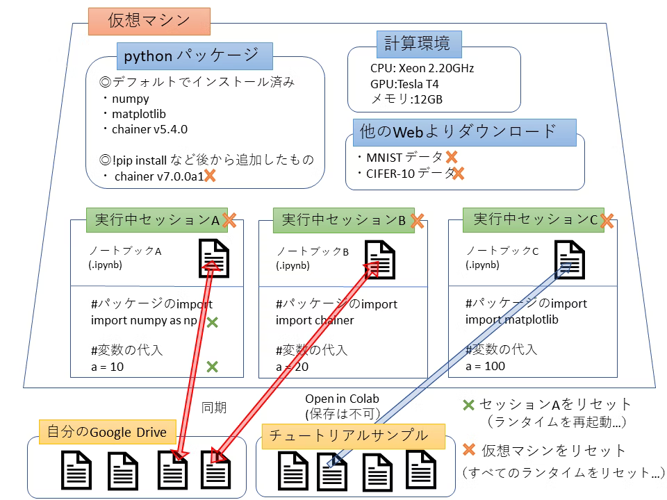

```markdown
!pip install -qU sentencepiece pywavelets datasets huggingface_hub pytest cut-cross-entropy

## 2. 設定とデータセットの準備

設定クラスを使用して、各種パラメータを設定します。

```python
from slm.config import PathsConfig, ModelConfig, TrainingConfig

# パス設定
paths_config = PathsConfig()
# モデル設定
model_config = ModelConfig()
# トレーニング設定
training_config = TrainingConfig(
    batch_size=16,
    accumulation_steps=4, # 変更したい場合は書き込む
)
```

## 3. データセットのダウンロードと前処理

データがない場合は自動的にダウンロードされます。

```python
from slm.data_loader import download_dataset, load_and_preprocess_dataset
from transformers import T5TokenizerFast

# トークナイザーの準備
tokenizer_path = paths_config.tokenizer_path
# 初回
tokenizer = JapaneseTokenizer(hf_model="NovelAI/nerdstash-tokenizer-v2", save_to=paths_config.tokenizer_path)
# ２回目以降
tokenizer = JapaneseTokenizer(model_file=tokenizer_path)

# データセットのダウンロード（初回のみ実行される）
download_dataset(paths_config)

# データセットの読み込みと前処理
dataset_dict = load_and_preprocess_dataset(
    tokenizer,
    paths_config,
    training_config
)

train_dataset = dataset_dict["train"]
valid_dataset = dataset_dict["validation"] if "validation" in dataset_dict else dataset_dict["test"]

print(f"トレーニングデータ: {len(train_dataset)} サンプル")
print(f"検証データ: {len(valid_dataset)} サンプル")
```

## 4. モデルのトレーニング

準備したデータセットを使ってモデルを学習します。

```python
import torch
from slm.model import WaveHierarchicalLM
from torch.utils.data import DataLoader
from torch.optim import AdamW
from tqdm.notebook import tqdm

# デバイス設定
device = torch.device("cuda" if torch.cuda.is_available() else "cpu")
print(f"使用デバイス: {device}")

# モデルの初期化
model_config.set_tokenizer(tokenizer)
print(f"Vocabulary Size: {model_config.vocab_size}") # vocab_sizeを表示
model = WaveHierarchicalLM(model_config)
model.to(device)

# DataLoaderの準備
train_loader = DataLoader(
    train_dataset, 
    batch_size=training_config.batch_size,
    shuffle=True
)

# 最適化アルゴリズム
optimizer = AdamW(model.parameters(), lr=training_config.learning_rate)

# トレーニングループ
model.train()
for epoch in range(3):  # 3エポック
    total_loss = 0
    progress_bar = tqdm(train_loader, desc=f"Epoch {epoch+1}")
    
    for batch_idx, batch in enumerate(progress_bar):
        # バッチをデバイスに転送
        input_ids = batch["input_ids"].to(device)
        labels = batch["labels"].to(device)
        
        # 勾配をリセット
        optimizer.zero_grad()
        
        # 前方伝播
        outputs = model(input_ids=input_ids, labels=labels)
        loss = outputs.loss
        
        # 勾配蓄積（gradient accumulation）
        loss = loss / training_config.accumulation_steps
        loss.backward()
        
        if (batch_idx + 1) % training_config.accumulation_steps == 0:
            optimizer.step()
        
        # 損失の記録
        total_loss += loss.item()
        progress_bar.set_postfix({"loss": loss.item()})
        
        if batch_idx > 100:  # デモ用に少数のバッチだけ処理
            break
    
    avg_loss = total_loss / (batch_idx + 1)
    print(f"Epoch {epoch+1} 平均損失: {avg_loss:.4f}")

# モデルの保存
save_path = f"{paths_config.model_save_dir}/wave_model.pt"
torch.save(model.state_dict(), save_path)
print(f"モデルを保存しました: {save_path}")
```

## 5. モデルの評価と推論

トレーニング済みのモデルを評価し、テキスト生成を行います。

```python
# モデル評価
def evaluate_model(model, dataset, device, batch_size=4):
    model.eval()
    dataloader = DataLoader(dataset, batch_size=batch_size)
    total_loss = 0
    total_tokens = 0
    
    with torch.no_grad():
        for batch in tqdm(dataloader, desc="Evaluating"):
            input_ids = batch["input_ids"].to(device)
            labels = batch["labels"].to(device)
            
            outputs = model(input_ids=input_ids, labels=labels)
            loss = outputs.loss
            
            # ラベルの形状に基づいてトークン数を計算
            non_padded = (labels != -100).sum().item()
            total_tokens += non_padded
            total_loss += loss.item() * non_padded
    
    avg_loss = total_loss / total_tokens
    perplexity = torch.exp(torch.tensor(avg_loss)).item()
    return perplexity

# テキスト生成（推論）
def generate_text(model, tokenizer, prompt, max_length=50, device="cpu"):
    model.eval()
    
    # プロンプトのトークン化
    input_ids = tokenizer.encode(prompt, return_tensors="pt").to(device)
    
    # 文章生成
    with torch.no_grad():
        generated_ids = model.generate(
            input_ids, 
            max_length=max_length,
            num_beams=5,
            no_repeat_ngram_size=2
        )
    
    # トークンIDからテキストに変換
    generated_text = tokenizer.decode(generated_ids[0], skip_special_tokens=True)
    return generated_text

# モデル評価の実行
ppl = evaluate_model(model, valid_dataset, device, batch_size=4)
print(f"Perplexity: {ppl:.2f}")

# テキスト生成のデモ
prompt = "今日の天気は"
generated = generate_text(model, tokenizer, prompt, max_length=50, device=device)
print(f"プロンプト: {prompt}")
print(f"生成結果: {generated}")
```

## 注意事項

1. Google Colabのセッションは一定時間後に切断されるため、長時間の学習には注意が必要です
2. 大規模なモデルを扱う場合は、Google Colabのメモリ制限に注意してください
3. トークナイザーやモデルの設定は、使用するデータに合わせて適宜調整してください

## トラブルシューティング

- **メモリエラーが発生する場合**: バッチサイズやモデルサイズを小さくする
- **学習が不安定な場合**: 学習率を小さく調整する
- **データ読み込みエラー**: パス設定を確認し、Google Driveのマウントが正常に行われているか確認する
```


```